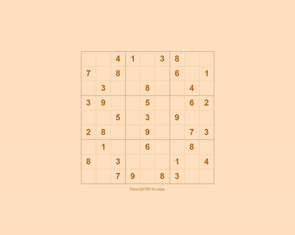
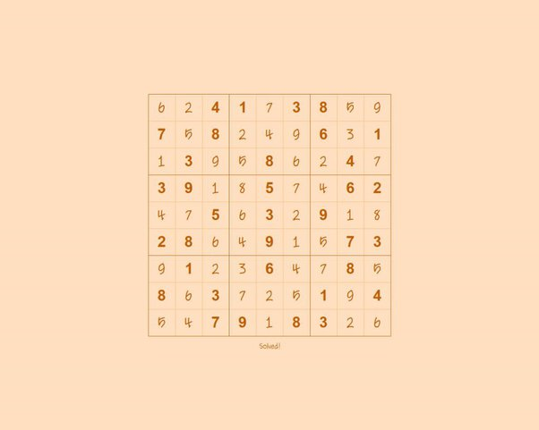

# CS50x-Project-Ideas
A curated collection of project ideas for CS50x final projects.

---

## Campus Lost-and-Found System

### Overview
A web application that allows users to report lost items and post found items within a campus community.

The platform helps people recover lost belongings by matching reports and providing contact options.

### Difficulty

Intermediate

### Core Features

- Post lost items
- Post found items
- Upload item images
- Search items by category
- Contact the person who posted the item

### Example Usage
```
$ python app.py
Server running at http://localhost:5000
```


### Concepts Used

- SQL databases
- User authentication
- File uploads
- Web routing

### Possible Extensions

- AI-based image matching
- Email notifications
- Item status tracking
- Campus-specific filtering

---
# Jigsaw Puzzle

## Overview:
In this program, you chop a picture into squares, splatter the squares on the screen, and let the user drag them into place with the mouse

## Difficulty:
Advanced

## Jigsaw Puzzle

A graphical puzzle game where an image is cut into square pieces, shuffled randomly across the screen, and the user must drag the pieces back into their correct positions.

This project challenges you to implement **drag-and-drop interaction, coordinate logic, and image manipulation**.

### Concept

The program takes an image and:

1. **Splits it into square pieces**
2. **Randomly scatters the pieces on the screen**
3. Lets the user **drag pieces with the mouse**
4. When a piece is near its correct position, it **snaps into place on a grid**

#### Example puzzle pieces:


### Features

* Image is automatically divided into puzzle tiles
* Tiles are randomly scattered on the screen
* Drag-and-drop interaction using the mouse
* **Grid snapping** helps pieces align correctly
* Puzzle completion detection

### Concepts Practiced

This project reinforces several important programming concepts:

 - 2D coordinate systems
 - Mouse event handling
 - Collision detection
 - Image manipulation
 - Game loop logic
 - State management

### Difficulty

Intermediate

### Suggested Technologies

You can implement this project using:

**Python**

* `pygame`
* `tkinter`

**Web**

* JavaScript
* HTML Canvas

**Other options**

* Java + Swing
* C++ + SDL

### Possible Extensions

If you want to push this project further:

* Add **different puzzle sizes (4x4, 8x8, 16x16)**
* Add **image selection**
* Add **scoreboard or leaderboard**
* Add **multiplayer puzzle race**
* Add **AI solver**

### Learning Outcome

After completing this project you will understand:

 - How graphical programs manage objects
 - How drag-and-drop systems work
 - How games track and update object states
 - How to structure interactive programs

---

## Sudoku Solver

### Overview
Make a Sudoku Solver, which will solve every problem the user gives him. 
The object is to get one, and only one, of each digit in each row, column, and 3-by-3 block.

Technically speaking, it’s a “recursive backtracking” routine. It tries a number in a blank cell, then calls itself to try another number in another blank cell. If everything works out, we’re done. If we get stuck, it works backward, erasing the mistakes and trying again with a different starting number. It’s fun to watch; you just draw the puzzle on the screen right before each recursive call.

### Difficulty
Intermediate

### Core Features

 - Recursive Structure
 - State Detection
 - Sequential Guessing
 - Validation Logic
 - The "Backtrack" (Undo)
 - Visual Feedback

### Example Usage:
This is a Sudoku puzzle:



This is what it looks like after the program solves it:



### Concepts Used:

 - Recursive Backtracking
 - Constraint Satisfaction
 - Data Structures
 - Search and Iteration

### Possible Extensions:

 - Build a Sudoku Generator
 - Implement a Vision-Based Solver
 - Visualisation and Animation
