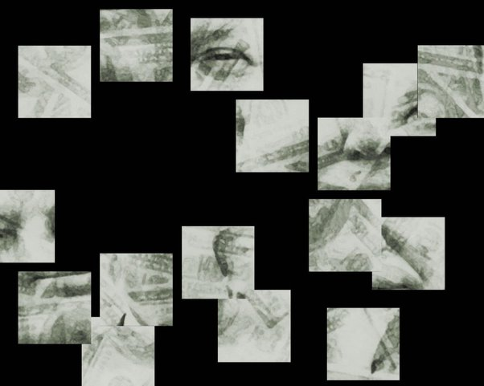

# Jigsaw Puzzle

## Overview:
In this program, you chop a picture into squares, splatter the squares on the screen, and let the user drag them into place with the mouse

## Difficulty:
Advanced

# Jigsaw Puzzle

A graphical puzzle game where an image is cut into square pieces, shuffled randomly across the screen, and the user must drag the pieces back into their correct positions.

This project challenges you to implement **drag-and-drop interaction, coordinate logic, and image manipulation**.

## Concept

The program takes an image and:

1. **Splits it into square pieces**
2. **Randomly scatters the pieces on the screen**
3. Lets the user **drag pieces with the mouse**
4. When a piece is near its correct position, it **snaps into place on a grid**

### Example puzzle pieces:

## Features

* Image is automatically divided into puzzle tiles
* Tiles are randomly scattered on the screen
* Drag-and-drop interaction using the mouse
* **Grid snapping** helps pieces align correctly
* Puzzle completion detection

## Concepts Practiced

This project reinforces several important programming concepts:

 - 2D coordinate systems
 - Mouse event handling
 - Collision detection
 - Image manipulation
 - Game loop logic
 - State management

## Difficulty

Intermediate

## Suggested Technologies

You can implement this project using:

**Python**

* `pygame`
* `tkinter`

**Web**

* JavaScript
* HTML Canvas

**Other options**

* Java + Swing
* C++ + SDL

## Possible Extensions

If you want to push this project further:

* Add **different puzzle sizes (4x4, 8x8, 16x16)**
* Add **image selection**
* Add **scoreboard or leaderboard**
* Add **multiplayer puzzle race**
* Add **AI solver**

## Learning Outcome

After completing this project you will understand:

 - How graphical programs manage objects
 - How drag-and-drop systems work
 - How games track and update object states
 - How to structure interactive programs

> This idea was inspired by this [post](https://www.quora.com/Hey-Im-15-years-old-I-just-finished-cs50-and-now-I-need-ideas-for-CS50x-final-project-I-want-to-make-something-that-actually-solves-a-problem-or-something-unusual-using-my-web-programming-skills-that-I-gained) on Quora.
